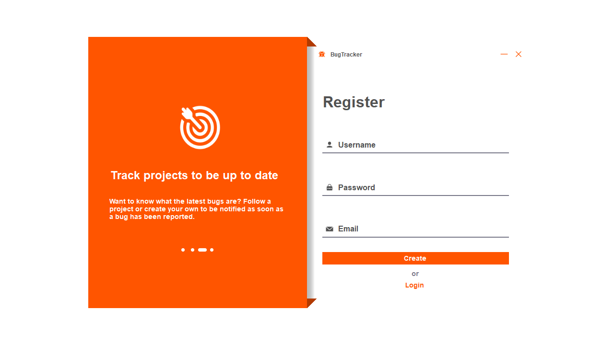

<h1>
  
</h1>

<p>
  An issue-tracking desktop application, written in C# using the WinForms library, that enables discovery, management, and collaboration in handling bugs for projects.
</p>

> **Note** Development on this project has been paused.

<br>

<details><summary><b>Contents</b></summary>
  <ul>
    <li><a href="#introduction">Introduction</a></li>
    <li><a href="#features">Features</a></li>
    <li><a href="#demo">Screenshots</a></li>
    <li><a href="#install">How to Install</a></li>
    <li><a href="#tutorial">How to Use</a></li>
    <li><a href="#specification">Project Specification</a></li>
    <li><a href="#prototype">Design Prototype</a></li>
    <li><a href="#team">Team</a></li>
  </ul>
</details>

<br>

<h2 id="introduction">
  Introduction
</h2>

Having recently finished the Software Engineering module in the 2nd year of our Computer Science degree, we decided to get together to apply our newfound knowledge of Git, WinForms, and developing software remotely in teams.

The idea for making a bug tracker desktop application for Windows began as Kean had already made a bare-bones browser-based version. This meant the project took off quickly as an understanding of the project had already been established and other areas could be focused on like the design and further functionality.

The project started using the waterfall method with design documents and planning, but later adjusted to agile with weekly meetings and an iterative approach to new features as this better matched the industry that we were trying to emulate experience for.

<br>

<h2 id="features">
  Features
</h2>

- Account login and registration system
  - Including password reset/recovery
- Dashboard for analysing personal contributions and statistics
  - A private hub to enable easier access to assigned bugs and projects
- Project management
  - Create or subscribe to a project to receive notifcations on updates
- Report bugs within projects
  - Update progress of bug and changes; conversations can be held here for collaboration
- Cloud-hosted database storing accounts, projects, and bugs for synchonised access

<br>

<h2 id="demo">
  Screenshots
</h2>





<br>

<h2 id="install">
  How to Install
</h2>

1. Clone the repository via GitHub or Git
```bash
$ git clone https://github.com/BlackSun93/BugTrackerWindows
```

2. Open the project in Visual Studio

3. Run the program. Alternatively, click `Build > Build Solution` to access the program from outside Visual Studio by locating the now-compiled executable at `bugtracker/bin/debug/bugtracker.exe`

<br>

<h2 id="tutorial">
  How to Use
</h2>

> **Warning** On first use, a pop-up will require you to accept Google Drive access for images to be stored for projects. This is neccessary for the program to function correctly.

1. Open the application and log in or create an account. If you have forgotten your password, click `Forgot my password` to reset it through your email.

2. Head over to the projects page by clicking on `Projects` from the navigation menu on the left side.

3. If you want to report a bug for a project that already exists, then click on the relevant project, otherwise, create a new project for it by clicking the green `+ Project` button at the top.

4. Once inside a project, you will see all the bugs associated with that project. To document a new bug, click on the `Report Bug` button at the top.

5. From the new page, enter a title and description about the issue, make sure to be specific so it is easier to fix. Set a priority level depending on the severity. When ready, click `Save`.

6. If there are any updates to the bug, navigating to it from inside the project and select `New Update`. Fill in the field with the update and update the status if necessary, followed by clicking `Post Update` when ready.

7. To log out, on any page, select the red logout button located in the top right next to the username.

<br>

<h2 id="specification">
  Project Specification
</h2>

The document containing the project specifications can be found <a href="specifications.pdf">here</a>. Written by Kean, it outlines the inspiration, user stories, database structure, and plan to develop the project.

<br>

<h2 id="prototype">
  Design Prototype
</h2>

Following the project specification document, a prototype for the design and UI was mocked up by Oliver to assist in directing the production towards a visual goal. Below are the three main scenes that were created:


<br>

<h2 id="team">
  Team
</h2>

||||||
|:---:|:---:|:---:|:---:|:---:|
|<a href="https://github.com/SunEmpire93">Kean</a>|<a href="https://github.com/omosborne">Oliver</a>|<a href="https://github.com/kb1107">Kieran</a>|<a href="https://github.com/Steliana-Guta">Steliana</a>|<a href="https://github.com/CCauston113">Charlotte</a>|
